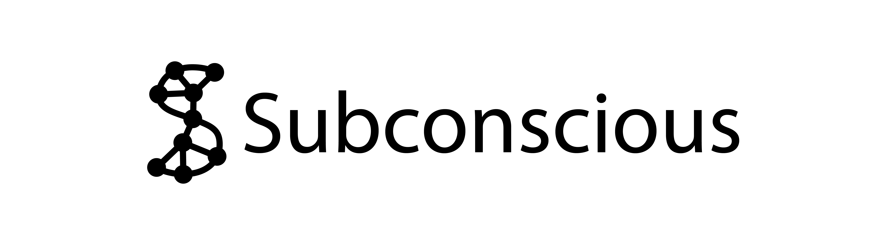
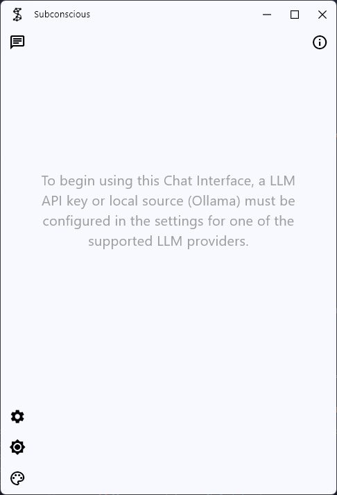
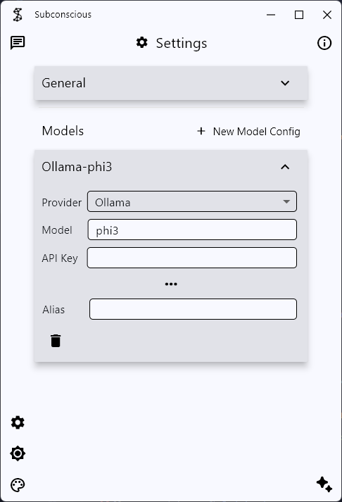
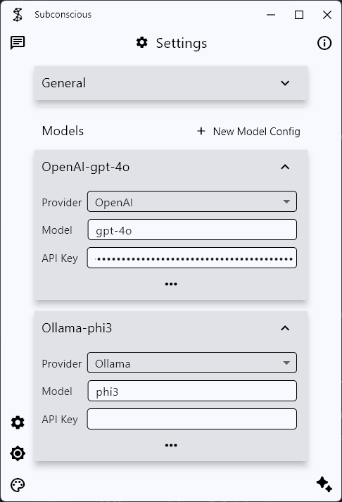
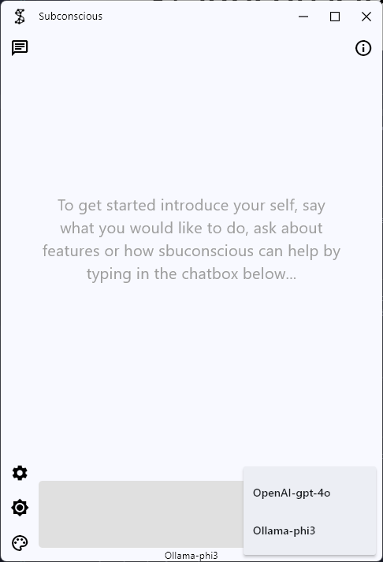
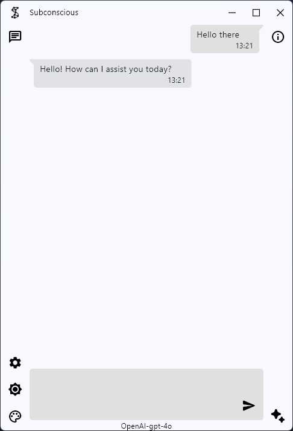

# Subconcious Chat UI (Alpha)

[Subconscious](https://subconscious.chat) is a desktop application for using LLMs and agents through a chat interface. Built in python using flet for the UI and langchain for the LLM interaction. Currently a small project for personal use and learning. Currently in alpha, supports OpenAI, Google, Ollama, Anthropic and Hugging Face APIs.

## Download & Installation

The windows application installer can be downloaded from the [Subconscious website](https://subconscious.chat). The application is available for Windows only. Also, the source and build for the latest release can be downloaded from the [releases page](https://github.com/baebranch/subconscious/releases) and extracted into the install folder.

## Usage & Configuration

Upon launching the application a Model configuration will need to be created in the settings screen, before the UI can be used:

The provider must be selected, the model name/id and the API key where required E.g. Ollama:

E.g. OpenAI:

The current model configuration in use is indicated at the bottom and can be changed by the LLM popup in the right sidebar:

The Subconscoius Chat UI is then ready to use:

## Roadmap

[Feature Roadmap](./docs/Feature_Roadmap.md)